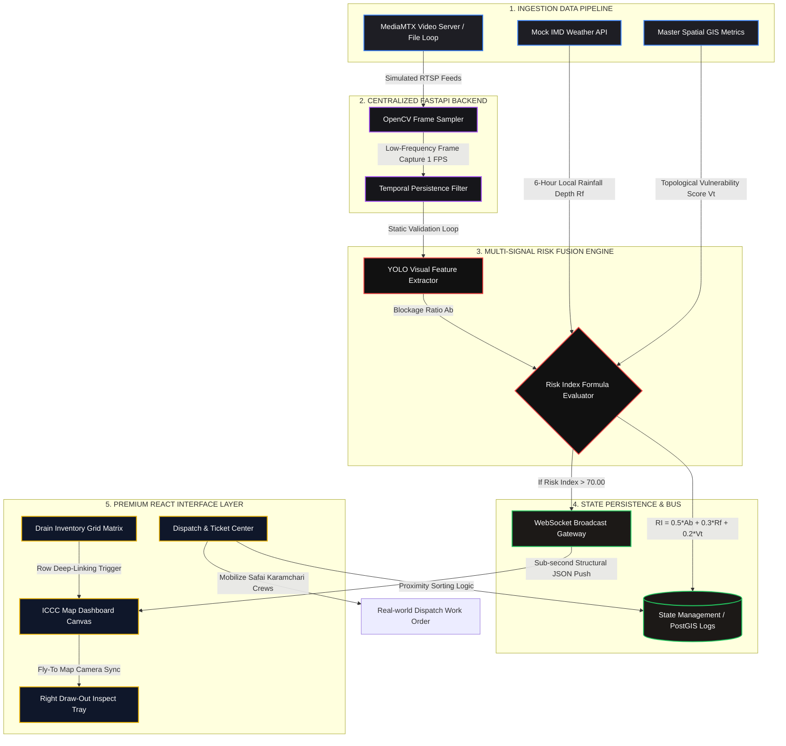

---

## Repository Blueprint


## Detailed Setup Manual

### Prerequisites

Before initialization, ensure your execution machine has the following frameworks installed:

* **Node.js** (v18.x or later recommended)
* **Python** (v3.10.x - v3.12.x)
* **Git** Version Control CLI

---

### Step 1: Clone & Initialize the Workspace

Open your terminal environment and pull down your repository files securely:

```bash
# Clone the repository using HTTPS
git clone [https://github.com/yourusername/swach-nikaas-pravah.git](https://github.com/yourusername/swach-nikaas-pravah.git)

# Move clean into the parent project directory
cd swach-nikaas-pravah

```

---

### Step 2: Backend Core Engine Configuration

1. Navigate to the backend directory and set up a clean Python virtual environment to prevent package version conflicts:
```bash
cd backend
python -m venv venv

```


2. Activate the virtual runtime context:
* **Linux/macOS:**
```bash
source venv/bin/activate

```


* **Windows (PowerShell):**
```bash
.\\venv\\Scripts\\Activate.ps1

```


3. Upgrade package installer and compile system dependencies from the manifest file:
```bash
python -m pip install --upgrade pip
pip install -r requirements.txt

```


4. Populate the `backend/mock_streams/` directory with 2-3 sample loopable video assets named `clean_drain.mp4` and `clogged_drain.mp4` to act as active camera simulation targets.

---

### Step 3: Frontend Interface Layer Configuration

1. Break into the client application directory from your root folder location:
```bash
cd ../frontend

```


2. Execute the package manager engine to ingest all upstream framework tokens, styling layouts, and interface components:
```bash
npm install

```


3. Verify that all required utility extensions (`lucide-react`, `tailwindcss-animate`, `clsx`, and charting dependencies) are processed smoothly during installation.

---

## 🚀 Execution Manual

To bring the entire local system cluster online, open two terminal windows running side-by-side:

### Terminal A: Launch the Intelligence Backend Server

Ensure your virtual environment context is currently active inside your directory frame, then execute:

```bash
cd backend
uvicorn main:app --host 127.0.0.1 --port 8000 --reload

```

*The backend services will spin up successfully at `http://127.0.0.1:8000`. You can review the interactive FastAPI documentation suite at `/docs`.*

### Terminal B: Launch the Interactive React Application

Initialize the high-speed Vite local development engine:

```bash
cd frontend
npm run dev

```

*The build framework will compile properties cleanly, exposing the dashboard at `http://localhost:5173` (or the console's assigned alternate local address).*

---

## ⏱️ Live Judging Presentation Runbook

To score maximum points during your 5-minute evaluation round, follow this interactive presentation path:

1. **The Green State Baseline:** Open the app at `/map`. Show judges the dark UI mode design framework displaying a normal, secure urban grid with low warning aggregates.
2. **Inject the Crisis Event:** Click the high-contrast `SIMULATE STORM` action button located in the top control console. This forces the FastAPI server to push simulated critical storm metrics down the open WebSocket data pipeline.
3. **The Triage Experience:** * Watch the global metrics count update instantly.
* Click the pulsing neon-red card on the Left Alert Feed—the map canvas will execute a smooth, cinematic camera pan-and-zoom glide to target the selected pin.


4. **Deep Analytics Presentation:** Point the panel to the sliding inspection tray. Showcase the raw camera feed next to the YOLO inference bounding boxes tracking the visual debris blockage index ($A_b$). Walk through the displayed Risk Fusion Index math block to prove system depth.
5. **Close the Loop:** Transition to the `/dispatch` section. Select the closest available sanitation squad inside the **Crew Proximity Sorting panel**, then select `DISPATCH CREW`. Show the judges how the ticket status updates to `IN FIELD` instantly without a single manual page refresh.

---

## ⚖️ License & Track Clearances

Developed for the **Bharath Academix Hackathon** under open-weights engineering evaluation criteria. All core data maps, stream simulations, and interfaces are optimized for rapid, real-time local MVP evaluation profiles.
"""

with open("/mnt/data/README.md", "w", encoding="utf-8") as f:
f.write(readme_content)

print("File generated successfully.")

```
Your comprehensive `README.md` documentation file is ready.

[file-tag: code-generated-file-0-1782014656607989807]

***

# SwachNikaasPravah (SNP) / DrainageAI 🌊👁️
### Intelligent Urban Drainage Surveillance & Multi-Signal Early Warning Network

An enterprise-grade GovTech Integrated Command and Control Centre (ICCC) platform designed for the **Bharath Academix Hackathon**. SNP repurposes existing municipal traffic and security CCTV infrastructure into a real-time, distributed edge-simulation sensory layer. By combining computer vision with real-time weather datasets and spatial topology models, it bridges the gap between passive urban monitoring and predictive disaster prevention.

---

## 🏗️ System Architecture & Data Flow

The platform operates on a centralized stream processing architecture designed for sub-second ingestion, low-frequency frame sampling to ensure high scalability, and active push notification delivery over WebSockets.



---

## 📂 Repository Blueprint

```text
swach-nikaas-pravah/
├── docs/                      # Technical Blueprinting Documents
│   ├── prd.md                 # Product Requirements Document
│   ├── trd.md                 # Technical Requirements Document
│   ├── schema.md              # Database Target Schema
│   └── design.md              # Token & Design Tokens Matrix
├── backend/                   # FastAPI Python Application Hub
│   ├── main.py                # Core Routes, Processing & WebSockets Loop
│   ├── requirements.txt       # Python Application Dependencies
│   └── mock_streams/          # Reference Looping Media Assets (.mp4 / .gif)
└── frontend/                  # React + Vite Production Client
    ├── src/
    │   ├── components/        # Map Canvas, Alert Sidebar, Inspection Tray
    │   ├── pages/             # Dashboard, Inventory Matrix, Dispatch Center
    │   ├── hooks/             # useWebSocket Persistence Implementations
    │   ├── App.jsx            # Entry View Matrix Layout
    │   └── main.jsx           # Mount Configuration
    ├── package.json           # Client Dependency Declarations
    ├── tailwind.config.js     # Custom Token Layout Config
    └── vite.config.js         # Engine Dev Tool Server Config

```

---

## 🛠️ Detailed Setup Manual

### Prerequisites

Before initialization, ensure your execution machine has the following frameworks installed:

* **Node.js** (v18.x or later recommended)
* **Python** (v3.10.x - v3.12.x)
* **Git** Version Control CLI

---

### Step 1: Clone & Initialize the Workspace

Open your terminal environment and pull down your repository files securely:

```bash
# Clone the repository using HTTPS
git clone https://github.com/yourusername/swach-nikaas-pravah.git

# Move clean into the parent project directory
cd swach-nikaas-pravah

```

---

### Step 2: Backend Core Engine Configuration

1. Navigate to the backend directory and set up a clean Python virtual environment to prevent package version conflicts:
```bash
cd backend
python -m venv venv

```


2. Activate the virtual runtime context:
* **Linux/macOS:**
```bash
source venv/bin/activate

```


* **Windows (PowerShell):**
```bash
.\venv\Scripts\Activate.ps1

```


3. Upgrade package installer and compile system dependencies from the manifest file:
```bash
python -m pip install --upgrade pip
pip install -r requirements.txt

```


4. Populate the `backend/mock_streams/` directory with 2-3 sample loopable video assets named `clean_drain.mp4` and `clogged_drain.mp4` to act as active camera simulation targets.

---

### Step 3: Frontend Interface Layer Configuration

1. Break into the client application directory from your root folder location:
```bash
cd ../frontend

```


2. Execute the package manager engine to ingest all upstream framework tokens, styling layouts, and interface components:
```bash
npm install

```


3. Verify that all required utility extensions (`lucide-react`, `tailwindcss-animate`, `clsx`, and charting dependencies) are processed smoothly during installation.

---

## 🚀 Execution Manual

To bring the entire local system cluster online, open two terminal windows running side-by-side:

### Terminal A: Launch the Intelligence Backend Server

Ensure your virtual environment context is currently active inside your directory frame, then execute:

```bash
cd backend
uvicorn main:app --host 127.0.0.1 --port 8000 --reload

```

*The backend services will spin up successfully at `http://127.0.0.1:8000`. You can review the interactive FastAPI documentation suite at `/docs`.*

### Terminal B: Launch the Interactive React Application

Initialize the high-speed Vite local development engine:

```bash
cd frontend
npm run dev

```

*The build framework will compile properties cleanly, exposing the dashboard at `http://localhost:5173` (or the console's assigned alternate local address).*

---

## ⏱️ Live Judging Presentation Runbook

To score maximum points during your 5-minute evaluation round, follow this interactive presentation path:

1. **The Green State Baseline:** Open the app at `/map`. Show judges the dark UI mode design framework displaying a normal, secure urban grid with low warning aggregates.
2. **Inject the Crisis Event:** Click the high-contrast `SIMULATE STORM` action button located in the top control console. This forces the FastAPI server to push simulated critical storm metrics down the open WebSocket data pipeline.
3. **The Triage Experience:** * Watch the global metrics count update instantly.
* Click the pulsing neon-red card on the Left Alert Feed—the map canvas will execute a smooth, cinematic camera pan-and-zoom glide to target the selected pin.


4. **Deep Analytics Presentation:** Point the panel to the sliding inspection tray. Showcase the raw camera feed next to the YOLO inference bounding boxes tracking the visual debris blockage index ($A_b$). Walk through the displayed Risk Fusion Index math block to prove system depth.
5. **Close the Loop:** Transition to the `/dispatch` section. Select the closest available sanitation squad inside the **Crew Proximity Sorting panel**, then select `DISPATCH CREW`. Show the judges how the ticket status updates to `IN FIELD` instantly without a single manual page refresh.

---

## ⚖️ License & Track Clearances

Developed for the **Bharath Academix Hackathon** under open-weights engineering evaluation criteria. All data maps, stream simulations, and interfaces are optimized for rapid, real-time local MVP evaluation profiles.